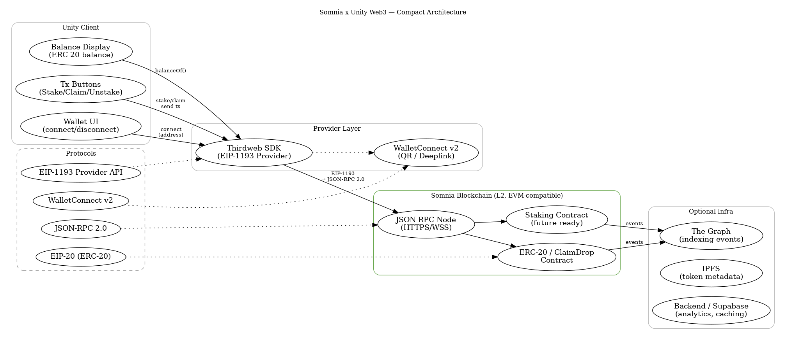

# Yield DeFi — Unity Web3 Mint + Trigger-Gated UI + DOTween + Teleport  

  
  
  
  

🚀 A clean **Unity Web3 DeFi Template** for demos, training sims, and WebGL prototypes.  

---

## ✨ Features  

- ✅ **Blockchain-first UX:** Mint NFT or claim tokens **only after on-chain success** (via `BlockchainManager` → `ClaimDropERC20`).  
- 🎯 **Trigger-gated interactions:** Buttons only appear when inside designated trigger zones.  
- 💫 **Juicy UI with DOTween:** Pop-in/out animations for smooth UI transitions.  
- 🌀 **Teleportation system:** Enter trigger → instantly move to destination (works with `NavMeshAgent`, `CharacterController`, or `Rigidbody`).  
- 💾 **Persistence:** Minted items are stored with `PlayerPrefs` and auto-rebuild UI on reload.  

Perfect for:  
- WebGL demo kiosks  
- Hackathon projects  
- Training simulations  
- Prototype Web3 UX flows  

---

## 🧱 Compact Architecture  

Here’s how **Unity x Somnia Web3** stacks together:  

  

Key layers:  
- **Unity Client** → Balance display, stake/claim buttons, wallet connect UI  
- **Provider Layer** → `Thirdweb SDK` (EIP-1193), WalletConnect v2  
- **Somnia Blockchain (L2)** → JSON-RPC nodes, staking contracts, ERC-20 claimdrop  
- **Optional Infra** → The Graph (indexing), IPFS (metadata), Supabase backend  

---

## 🧱 Smart Contracts  

- **ClaimDrop (ERC-20):**  
  `0x754F014dFC79eE5b3bd4335637622Ce03f26bBd9`  

- **Future-ready staking contract** integrated for extension.  

---

## 📂 Project Setup  

### Requirements  
- Unity **2022.3+**  
- [DOTween Pro](http://dotween.demigiant.com/)  
- A deployed ERC-20 / ClaimDrop contract  

### Steps  
1. Clone repo & open in Unity.  
2. Install DOTween via Unity Package Manager.  
3. Update contract address in `BlockchainManager.cs`.  
4. Build for **WebGL** or **Standalone**.  

---

## 🔮 Roadmap  

- [ ] Cross-chain bridges  
- [ ] Staking UI integration  
- [ ] GraphQL analytics with The Graph  
- [ ] Custom NFT card templates  

---

## 📊 Pitch Deck  

👉 [Google Drive Link](https://drive.google.com/drive/folders/1UAL1SCvkxvPXBvmGpk_DyoP6QAlQskQK?usp=sharing)  

---

## 📜 License  

MIT — free for personal & commercial use.  
